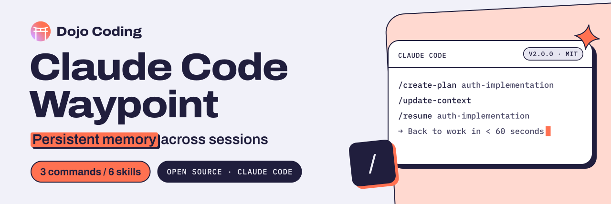

<p align="center">
  <a href="https://dojocoding.io">
    <picture>
      <source media="(prefers-color-scheme: dark)" srcset="docs/assets/banner-dark.svg">
      <source media="(prefers-color-scheme: light)" srcset="docs/assets/banner-light.svg">
      
    </picture>
  </a>
</p>

# Claude Code Waypoint

**A Claude Code toolkit that keeps each task's plan, context and checklist in files, for builders on long-running work.**

**Never lose context again.** Strategic waypoints for persistent memory and intentional context management in Claude Code projects.

[](LICENSE)
[](CHANGELOG.md)

[Get started](#quick-start) · [How to use](#how-to-use-the-waypoint-workflow) · [Docs](#documentation) · [Contribute](CONTRIBUTING.md) · [Report an issue](https://github.com/DojoCodingLabs/claude-code-waypoint/issues/new)

---

## The Problem

Working with AI on complex projects means:
- ❌ **Context resets** force you to start from scratch
- ❌ **Lost decisions** - no record of why choices were made
- ❌ **Forgotten progress** - can't remember what's done
- ❌ **Broken continuity** - every session feels like day one
- ❌ **Manual repetition** - explaining the same things over and over

## The Solution

Claude Code Waypoint creates **strategic checkpoints** throughout your project journey:

- ✅ **Resume in < 60 seconds** after any context reset
- ✅ **Persistent memory** across sessions, days, weeks
- ✅ **Auto-activating skills** provide the right context automatically
- ✅ **Decision logging** captures the "why" behind choices
- ✅ **Works beyond code** - planning, research, any long-running work

**Waypoints are navigation markers** that help you track progress, return to known points, and resume quickly from exactly where you left off.

---

## Quick Start

### Installation

Copy Claude Code Waypoint to your project:

```bash
# Clone this repository
git clone https://github.com/DojoCodingLabs/claude-code-waypoint

# Copy to your project
cp -r claude-code-waypoint/.claude /path/to/your/project/
cp -r claude-code-waypoint/plans /path/to/your/project/

# Set up hooks
cd /path/to/your/project/.claude/hooks
npm install && chmod +x *.sh
```

### Your First Waypoint

```bash
# Create a waypoint for a feature
/create-plan auth-implementation

# Work on your feature...
# Waypoint tracks context automatically

# Before taking a break
/update-context

# Resume later (even after context reset)
/resume auth-implementation
# → Back to work in < 60 seconds
```

**[→ Detailed Installation Guide](INSTALLATION.md)**

---

## How to Use: The Waypoint Workflow

### Step 1: Plan First (Think & Document)

Start by having Claude help you think through requirements:

```bash
/plan Build authentication system with OAuth and JWT
```

Claude will help you:
- Clarify requirements and edge cases
- Identify technical decisions
- Consider architecture options
- Document initial approach

**Key Point:** This is exploration mode. Ask questions, refine thinking, iterate.

### Step 2: Create Official Waypoint (Formalize)

Once requirements are clear, formalize into waypoint structure:

```bash
/create-plan auth-system
```

This creates the **3-file waypoint**:
```
plans/active/auth-system/
├── auth-system-plan.md      # Strategy & architecture
├── auth-system-context.md   # Current state & decisions
└── auth-system-tasks.md     # Actionable checklist
```

Claude will populate these based on your planning discussion.

### Step 3: Review & Approve (Your Responsibility)

**This is critical:** You are the builder, you own the plan.

```bash
# Review the waypoint files
cat plans/active/auth-system/auth-system-plan.md

# Check if approach makes sense
# Verify architecture decisions align with your goals
# Ensure nothing critical is missing
```

**Ask yourself:**
- Does this approach make sense for my project?
- Are the trade-offs acceptable?
- What could go wrong?

**Approve explicitly:**
```
"I've reviewed the auth-system plan and approve it. Let's proceed."
```

### Step 4: Execute (Stay Context-Aware)

Now implement with Claude, maintaining context throughout:

```bash
# Claude implements based on approved plan
# Waypoint tracks progress automatically

# Before long breaks or context reset risk
/update-context

# After context reset
/resume auth-system
# → Back in < 60 seconds with full context
```

**While executing:**
- Update waypoint when you discover new information
- Log decisions and why they were made
- Track what's completed vs pending
- Document blockers as they appear

---

## Core Features

### 1. Persistent Memory System (PRIMARY)

The **3-file waypoint structure** captures everything:

```
plans/active/auth-implementation/
├── auth-implementation-plan.md      # Strategy (rarely changes)
├── auth-implementation-context.md   # Current state (updated frequently)
└── auth-implementation-tasks.md     # Actionable checklist (daily updates)
```

**What gets tracked:**
- **Decisions** - Why you chose specific approaches
- **Progress** - What's done, in progress, and pending
- **Blockers** - What's preventing progress
- **Next actions** - Specific file + function to work on
- **Key discoveries** - Important findings during work

**SESSION PROGRESS tracking** enables the < 60 second resume:

```markdown
## SESSION PROGRESS (2025-01-15 14:30)

### ✅ COMPLETED
- [x] Task 1 done
- [x] Task 2 done

### 🟡 IN PROGRESS
- [ ] Task 3 (CURRENT)

### 🎯 NEXT ACTION
Edit src/auth/login.ts - implement validateCredentials()
```

**[→ Deep dive: Waypoint Pattern](WAYPOINT_PATTERN.md)**

### 2. Auto-Activation System (CRITICAL)

Skills auto-activate based on context - right knowledge at the right time:

```
User types: "Create a new plan for..."
    ↓
Hook analyzes: prompt keywords + active files
    ↓
Auto-suggests: context-persistence skill
    ↓
Claude gets: Perfect context automatically
```

**Key skills that auto-activate:**
- **memory-management** - When you need to remember preferences
- **context-persistence** - When working with waypoint files
- **plan-approval** - When making significant changes

**[→ Learn more: Auto-Activation System](.claude/hooks/AUTO_ACTIVATION.md)**

### 3. Commands for Waypoint Management

- `/create-plan [task]` - Create new waypoint (3-file structure)
- `/update-context` - Update waypoint before context reset
- `/resume [task]` - Resume from existing waypoint

### 4. Specialized Agents

Copy-and-use agents for common workflows:
- **scaffold-customizer** - Adapt skills to your tech stack
- **documentation-architect** - Generate comprehensive docs
- **code-architecture-reviewer** - Review code for consistency
- **refactor-planner** - Plan refactoring strategies
- **plan-reviewer** - Review development plans
- **web-research-specialist** - Research technical issues

**[→ View all agents](.claude/agents/)**

---

## What's Included

### Core Skills (Memory & Context)

| Skill | Purpose |
|-------|---------|
| **memory-management** | Intentional memory tracking and preference learning |
| **context-persistence** | Waypoint pattern implementation |
| **plan-approval** | User control workflows for complex changes |

These work with **any tech stack** - they're methodology, not code.

### Example Scaffolds (Opinionated)

| Skill | Tech Stack |
|-------|------------|
| **frontend-dev-guidelines** | Next.js 14+ + React 19 + shadcn/ui |
| **backend-dev-guidelines** | Supabase + Edge Functions |

**Not using our stack?** Use the `scaffold-customizer` agent to adapt skills for your tech.

**[→ Customization guide](CUSTOMIZATION.md)**

### Skill Developer (Meta)

The **skill-developer** skill teaches you how to create custom skills with memory patterns.

**[→ Learn skill development](.claude/skills/skill-developer/)**

---

## Use Cases

### Software Development

```
Feature: Authentication refactor
Waypoint tracks:
- Current architecture decisions
- Migration progress (which files done)
- Blockers and workarounds discovered
- Testing approach and edge cases
- Performance benchmarks

Resume time: 45 seconds
```

### Business Planning

```
Project: Q1 strategy redesign
Waypoint tracks:
- Market research findings
- Stakeholder feedback
- Strategic options considered
- Resource allocation decisions
- Implementation timeline

Resume time: 30 seconds
```

### Research Projects

```
Research: ML model optimization
Waypoint tracks:
- Experiment results
- Hyperparameter tuning notes
- Performance comparisons
- Dead ends and why they failed
- Next experiment hypotheses

Resume time: 60 seconds
```

**The waypoint pattern works for any long-running work that requires persistent context.**

---

## Credits & Origin

This project packages the incredible work shared by **[diet103](https://github.com/diet103)** in their repository **[claude-code-infrastructure-showcase](https://github.com/diet103/claude-code-infrastructure-showcase)**.

### Original Inspiration

From the Reddit post: **["Claude Code is a Beast - Tips from 6 Months of Hardcore Use"](https://www.reddit.com/r/ClaudeAI/comments/1h4riv1/claude_code_is_a_beast_tips_from_6_months_of/)**

### What We Did

Building on this foundation, we added our own twist and improvements:
- **Introduced the "Waypoint" metaphor** - Renamed "dev docs" to "waypoints"
- **Transformed into distributable package** - Proper repository structure
- **Enhanced documentation** - Created comprehensive guides
- **Improved organization** - Restructured as `plans/` directory
- **Positioned correctly** - Memory/context management as PRIMARY
- **Made it accessible** - Simple copy-paste installation

**Core credit** goes to **diet103** for the innovative infrastructure patterns and 6 months of real-world validation.

---

## Documentation

### Getting Started
- **[Installation Guide](INSTALLATION.md)** - Detailed setup instructions
- **[Waypoint Pattern](WAYPOINT_PATTERN.md)** - Deep dive into the 3-file structure
- **[Philosophy](PHILOSOPHY.md)** - Why intentional memory matters

### Advanced Usage
- **[Customization Guide](CUSTOMIZATION.md)** - Adapt to your tech stack
- **[Integration Guide](WAYPOINT_INTEGRATION_GUIDE.md)** - AI-assisted setup
- **[Contributing](CONTRIBUTING.md)** - How to contribute

### Technical Reference
- **[CLAUDE.md](CLAUDE.md)** - Architecture for Claude Code
- **[Auto-Activation System](.claude/hooks/AUTO_ACTIVATION.md)** - How hooks work
- **[Skills Directory](.claude/skills/)** - All available skills

---

## Contributing

We welcome contributions! See [CONTRIBUTING.md](CONTRIBUTING.md) for guidelines.

**Contributions welcome:**
- Bug fixes and improvements
- New skills for different tech stacks
- Documentation enhancements
- Example waypoint templates

---

## Support

- **Issues:** [GitHub Issues](https://github.com/DojoCodingLabs/claude-code-waypoint/issues)
- **Discussions:** [GitHub Discussions](https://github.com/DojoCodingLabs/claude-code-waypoint/discussions)

---

## License

MIT License - See [LICENSE](LICENSE) for details. Built by [Dojo Coding](https://dojocoding.io).

<p align="center">
  <a href="https://dojocoding.io"></a>
</p>
